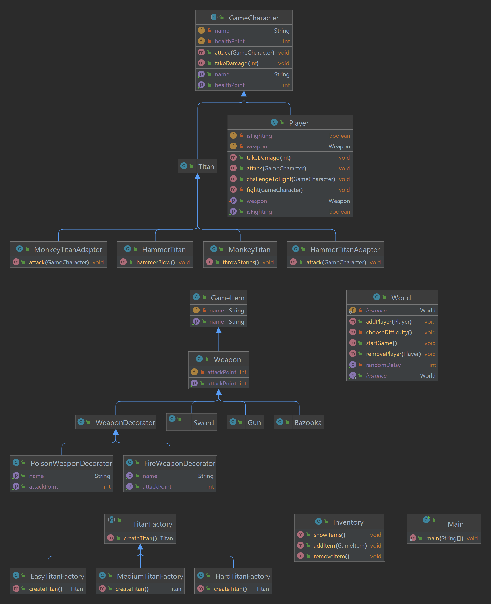

# Software Design Patterns - Final Project

## "Attack On Titan" Game

**Group:** SE – 2223

**Team members:** Bisembaev Arman, Abenova Sabina, Beketov Nurdaulet

---

## Introduction

### Overview
The project is a game set in the Attack of the Titan world.

The aim is to build a game utilizing several design patterns such as adapter, singleton, observer, factory, decorator, and strategy.

Design patterns are important in software development because they provide reusable solutions to common challenges. Their use in a project is critical to ensuring the scalability, maintainability, and efficiency of the game architecture.

### Objectives
- **Adapter Design Pattern:** Enables easy integration of different systems/interfaces within the game.
- **Singleton:** Utilizes a single instance of the "world" class to maintain global game characteristics and ensure unique access.
- **Observer:** Facilitates effective communication and updates between game components and interfaces.
- **Factory:** Utilizes the Factory pattern to generate various types of titans in the game.
- **Decorator:** Dynamically enhances game aspects by adding or updating features without altering the fundamental framework.
- **Strategy:** Employs different tactics to handle the game's difficulty levels.

The game will feature a terminal interface offering choices like "Start Battle," "Inventory," and "My Avatar." The Singleton "world" class, using the Strategy pattern, will enable users to choose a difficulty level (easy, medium, or hard) affecting the game's complexity.

Moreover, the Singleton "world" class, acting as a container, will incorporate a Strategy pattern to manage difficulty levels. The game class itself will function as a factory, creating monsters while employing the Singleton strategy pattern to adapt to varying difficulty levels.

The project aims to showcase how these design principles enhance the game's flexibility, scalability, and maintainability. It illustrates how utilizing these patterns in software development can lead to an efficient and well-structured game set in the Attack on Titan universe.

---

## Main

**Adapter**
- `HammerTitanAdapter` and `MonkeyTitanAdapter` adapt the behavior of `HammerTitan` and `MonkeyTitan` classes to conform to the `Titan` class.
- Inheritance enables the `Titan` class to inherit common properties and methods from `GameCharacter`.
- `HammerTitan` and `MonkeyTitan` represent specialized titan types with distinct methods (`hammerBlow()` and `throwStones()` respectively).
- Adapters extend the `Titan` class and utilize internal instances of `HammerTitan` and `MonkeyTitan` to access their specific methods (`hammerBlow()` and `throwStones()`) via the `attack(GameCharacter enemy)` method.

**Singleton(World)**
  
The Singleton pattern, implemented through the `World` class, ensures the application maintains only one instance of the `World` class. This is beneficial for managing global state and resources.

**Observer**

The Observer pattern is manifested in the `startGame()` method, creating a timer that periodically calls `challengeToFight()` on each player not engaged in battle. This functionality notifies players of titan battles and invites them to join.

**Factory**
- `TitanFactory` is an abstract class featuring a `createTitan()` method that subclasses must implement.
- Concrete implementations (`EasyTitanFactory`, `MediumTitanFactory`, `HardTitanFactory`) serve as factory methods to create instances of the `Titan` class with varying characteristics, particularly health.
- Each specific factory defines its logic within the `createTitan()` method, specifying health values for "light," "medium," and "heavy" titans respectively.

**Decorator**

Decorators dynamically add new behavior or functionality to an object without altering its structure. The following decorators are implemented:

- `FireWeaponDecorator` and `PoisonWeaponDecorator` inherit from `WeaponDecorator`, adding specific characteristics to existing weapons.
- These decorators override `getAttackPoint()` and `getName()` methods, introducing new attributes to the attack level and weapon name.
**Strategy**

---

## Conclusion

### Project Results

**Design Pattern Implementation:** Demonstrated effective use of multiple design patterns in the game architecture, ensuring scalability and maintainability.

**Integrated Game Mechanics:**

Proposed a terminal-based interface with features:
- Battle initiation
- Future inventory management
- Avatar detailing

### Pattern-Specific Functions

**Adapter**
Integrated specialized titans into the game through adaptable classes.

**Singleton**
Managed the game's global states and resources using a single instance of the `World` class.

**Observer**
Alerted players to titan battles and invited them to join the fights.

**Factory**
Created a variety of titans with different difficulty levels using factory methods.

**Decorator**
Dynamically improved weapons without altering their fundamental structure.

## Summary
The project demonstrates the effective use of various design patterns in the development of a game based on the anime "Attack on Titan". The integration of these patterns allowed us to create a flexible and scalable game architecture, present a variety of game mechanics and provide a complete gameplay experience.
### Challenges Faced

__Application Logic and Design Pattern Integration:__
Integrating various design patterns into the application logic posed challenges despite understanding their principles. Achieving effective interaction among these patterns required meticulous design and consumed considerable time.

__Testing and Debugging:__
With the expansion of functionality, the demand for comprehensive testing and debugging increased significantly. Ensuring the stability and correct operation of the entire system became more critical as the complexity grew.

__Game Mechanics Balancing__
Balancing game mechanics involved fine-tuning game difficulty, character attributes, and monster statistics to create an engaging and equitable gameplay experience. Achieving the right balance in damage, character capabilities, and monster health posed challenges.

### Future Improvements

**Inventory Class:**
Initiated the creation of the Inventory class, which will manage the user's available items.

- Implement methods to add, remove, and switch active weapons within the inventory.
- Allow the user to possess multiple items in the inventory and enable changing the active weapon.

**Character Level:**
Introduced a 'level' attribute to monitor the character's progression.

- Implemented a mechanism to elevate the character's level post-titan kills or meeting specific in-game objectives.
- Adjusted the character's damage based on their level to enhance gameplay immersion.

**Weapon Variety:**
Expanded the array of available weapons by incorporating new weapon types.
- Defined distinct characteristics for each weapon type, including attributes like damage, attack speed, and range.

**Weapon Decorators:**
Designed weapon decorators to augment the properties of existing weapons.

- Created decorators introducing special abilities or enhancements to enhance the capabilities of current weapons.

---

## References
[Refactoring Guru - Design Patterns - Factory Method](https://refactoring.guru/design-patterns/factory-method)

[Refactoring Guru - Observer Pattern](https://refactoring.guru/design-patterns/observer)

[Refactoring Guru - Adapter Pattern](https://refactoring.guru/design-patterns/adapter)
    
[Refactoring Guru - Strategy Pattern](https://refactoring.guru/design-patterns/strategy)

    